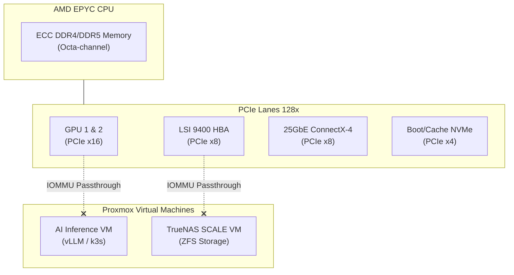

# Node 1: The EPYC Backend

The foundation of this disaggregated architecture relies on a strict separation of concerns. While the Ryzen Frontend handles high-frequency proxying and edge routing, the **EPYC Backend** is a purpose-built heavy lifter designed for 100B+ parameter AI inference and massive ZFS storage arrays.

## Why EPYC for the Backend?

In an enterprise homelab running large language models (LLMs) and massive storage pools, CPU clock speed is secondary. The true bottlenecks are **PCIe lanes** and **Memory Bandwidth**.

Consumer platforms (like Ryzen or Core i9) typically offer 20-24 usable PCIe lanes. An AMD EPYC single-socket platform offers up to **128 PCIe lanes**. 

That lane density is mandatory for this architecture because we need to simultaneously drive:
- Multiple GPUs for AI inference (running llama.cpp or vLLM) at `x16` or `x8` speeds.
- An LSI 9400 Broadcom Tri-Mode HBA for the TrueNAS ZFS array at `x8`.
- A 25GbE Mellanox ConnectX-4 Network Interface Card at `x8`.

Without an EPYC (or Xeon Scalable) processor, you are forced to use PLX switches or run GPUs at degraded `x4` speeds, heavily bottlenecking AI tensor operations.

## Hardware Architecture & PCIe Mapping

The hardware topology is designed to pass physical devices directly to Virtual Machines (PCI-e Passthrough / IOMMU) to eliminate hypervisor overhead.

## Storage: LSI 9400 HBA Passthrough

Data integrity is the absolute primary objective of this node. To achieve industry best practices for ZFS, the Proxmox hypervisor must **never** touch the raw storage drives.

Instead, we use a Broadcom LSI 9400 HBA flashed to IT mode. The physical HBA is mapped directly to a **TrueNAS SCALE** VM using IOMMU passthrough. TrueNAS gets unfettered, raw access to the 3x 8TB NAS drives to build a RAID-Z1 array. 

If a bit flips on a platter (bit-rot), ZFS running inside TrueNAS will immediately detect the checksum mismatch and heal the block dynamically.

## Networking Integration

The EPYC node connects directly to the high-speed backbone (the MikroTik CRS510) via a DAC or SFP28 transceiver. 

Traffic is cleanly segmented using the VLAN architecture deployed in [Phase 21](/pages/networking/homelab-architecture/enterprise-segmentation-migration):
- **VLAN 10 (Management):** For the Proxmox GUI and IPMI/BMC interfaces.
- **VLAN 30 (Compute):** For the AI inference API endpoints and TrueNAS NFS/SMB exports.

Because the EPYC and Ryzen nodes sit on the same high-speed L2 switch, heavy storage traffic between the frontend proxy and the backend NAS is hardware-offloaded, ensuring line-rate performance without touching the router's CPU.
