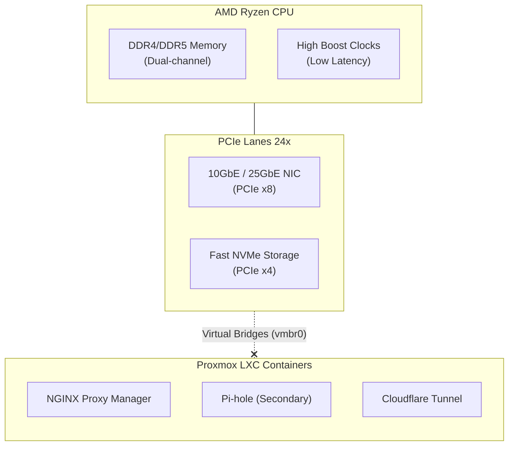

# Node 2: The Ryzen Frontend

If the EPYC node is the heavy-lifting factory, the **Ryzen Frontend** is the high-speed logistics hub. This node sits at the edge of our logical network, handling incoming requests, routing traffic, and running the control plane services that keep the lab alive.

## Why Ryzen for the Frontend?

While EPYC excels at running 100 things simultaneously, Ryzen excels at running a few things incredibly fast. Frontend workloads like NGINX reverse proxies, Cloudflare Tunnels, and Pi-hole DNS instances do not need 128 PCIe lanes or 64 cores. They need **single-core performance** and **low latency**.

A consumer Ryzen processor (like the Ryzen 9 7900X or 5950X) operates at much higher boost clocks (often 5.0GHz+) compared to server-grade EPYCs. This drastically reduces the latency of web requests hitting your proxy before being handed off to the backend databases.

Furthermore, Ryzen platforms are highly power-efficient at idle, making them perfect for 24/7 edge routing services.

## Hardware Architecture & Flow

The Ryzen node is purposefully kept lightweight. It does not run massive ZFS pools or pass through GPUs. It relies heavily on ultra-fast NVMe storage and Proxmox LXC containers.

## Storage: Fast & Disposable

Unlike the EPYC node, we don't care about petabytes of storage here. The Ryzen node runs entirely on extremely fast NVMe drives. 

The workloads hosted here (reverse proxies, DNS sinkholes, monitoring dashboards) are fundamentally ephemeral. If the NVMe drive fails, we don't rely on complex ZFS RAID arrays on this node; we simply provision a new NVMe drive and restore the lightweight LXC backups from our Proxmox Backup Server.

## Networking Integration

The Ryzen node sits squarely on the **Core Services (VLAN 20)** and **Management (VLAN 10)** networks.

Its primary role is to bridge the gap between the internet and the isolated Compute layer.
1. A request hits the Cloudflare Tunnel container.
2. The tunnel forwards it to the NGINX Reverse Proxy container.
3. NGINX authenticates the request and routes it across the 10GbE/25GbE backbone directly to the EPYC node (VLAN 30) for processing.

Because the proxy logic runs on a high-clock-speed Ryzen core, this entire decision tree happens in micro-seconds, ensuring the network edge never bottlenecks the massive backend compute power.
