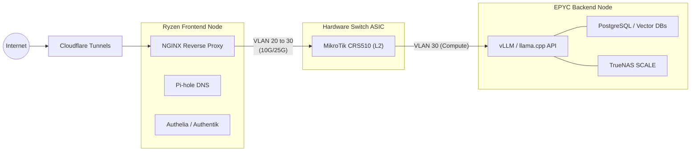

# Workload Segregation

With a disaggregated architecture consisting of an EPYC Backend and a Ryzen Frontend, the question is no longer *how* to host a service, but *where* to host it.

Treating both nodes as a generic pool of compute is a mistake. To maximize the 10-year lifespan of this hardware and ensure your 100B+ parameter AI models don't starve your reverse proxy, workloads must be strictly segregated by role.

## The Routing Topology

Traffic flows through this architecture in a predictable, linear path.

## Node 2: The Ryzen Frontend (Edge & Control Plane)

The Ryzen node is the tip of the spear. It sits closest to the router and handles all ingress and core network services.

**Workload Profile:** High frequency, low latency, bursty CPU, low RAM footprint.

**What goes here?**
- **Edge Security:** Cloudflare Tunnels (cloudflared), NGINX Proxy Manager, Authelia.
- **Network Services:** Pi-hole (DNS sinkholing), Kuma Uptime (monitoring).
- **Management Plane:** Portainer/Rancher UI, Proxmox Backup Server (if not hosted off-site).

**Why?** Because Ryzen's massive single-core boost clocks process incoming HTTP requests and TLS terminations in micro-seconds. Keeping these services on the Frontend guarantees that even if the EPYC node is pegged at 100% CPU running a massive tensor calculation, your network routing and web proxies remain lightning fast.

## Node 1: The EPYC Backend (Data & Compute Plane)

The EPYC node is the vault. It has massive memory bandwidth, dozens of cores, and 128 PCIe lanes to handle massive parallel workloads.

**Workload Profile:** Sustained high CPU, massive RAM footprint, heavy disk I/O, GPU acceleration.

**What goes here?**
- **AI Inference:** vLLM, llama.cpp, OpenWebUI backend. (Passed through to the physical GPUs).
- **Storage:** TrueNAS SCALE (passed through to the LSI HBA).
- **Databases:** PostgreSQL, Milvus/Qdrant vector databases.
- **Heavy Compute:** Kubernetes (k3s) worker nodes, CI/CD runners.

**Why?** Because loading a 100B+ parameter AI model requires sharding across multiple GPUs and pushing 100GB+ of weights through system memory. EPYC's octa-channel memory architecture handles this without breaking a sweat, while its PCIe lanes ensure the TrueNAS VM can simultaneously serve datasets without bottlenecking the GPUs.

## Conclusion

By segregating the workloads, we achieve a true enterprise topology:
- **Resilience:** The failure of an AI experiment on the backend won't take down DNS for the rest of the house.
- **Security:** Ingress traffic terminates on the Ryzen node (VLAN 20). Only authenticated, proxied traffic is allowed to cross the switch into the Compute tier (VLAN 30) where the sensitive databases live.
- **Performance:** Hardware capabilities are matched perfectly to the software profiles.
