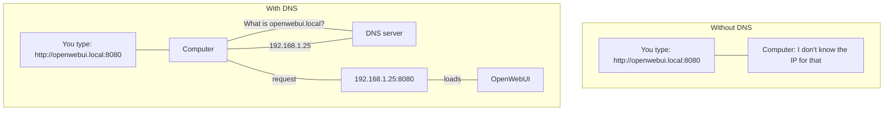
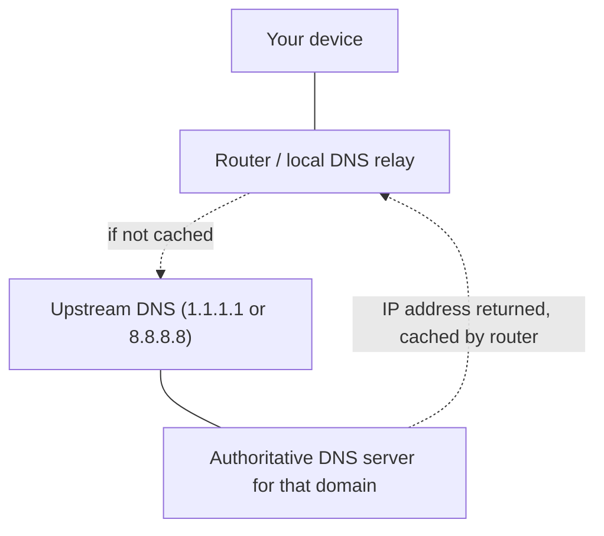

# DNS Fundamentals

DNS converts human-readable names into IP addresses. Without it, every service would need to be reached by raw address.



## DNS Resolution Chain



## Local DNS Names

mDNS lets devices on the same network discover each other by hostname without central configuration.

```text
Container sets hostname: openwebui
mDNS broadcasts:         "I am openwebui.local at 192.168.1.25"
Other devices can use:   http://openwebui.local
```

This is convenient, but it is usually less predictable than explicit infrastructure DNS.

## Custom Local DNS via dnsmasq

Routers running dnsmasq, including ASUS Merlin, can map hostnames directly to IP addresses.

```text
address=/proxmox.home/192.168.1.20
address=/nas.home/192.168.1.30
```

That approach is more reliable than mDNS for servers, storage, and internal services you expect to stay stable.

`nas.home` is a good example of where that stability matters. The hostname can stay fixed even if the storage role behind it evolves into the Proxmox-backed NAS layout in [TrueNAS SCALE On Proxmox](/pages/proxmox/workloads/truenas-scale).