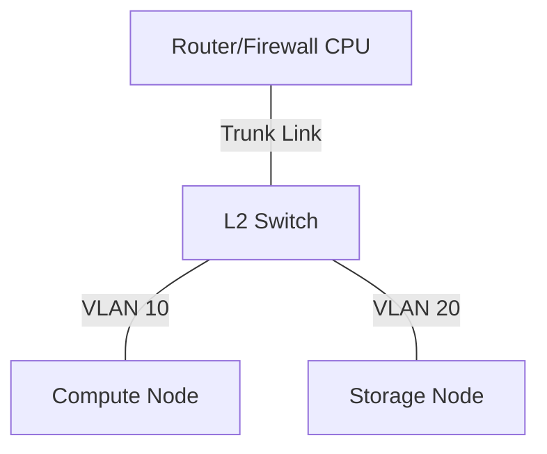
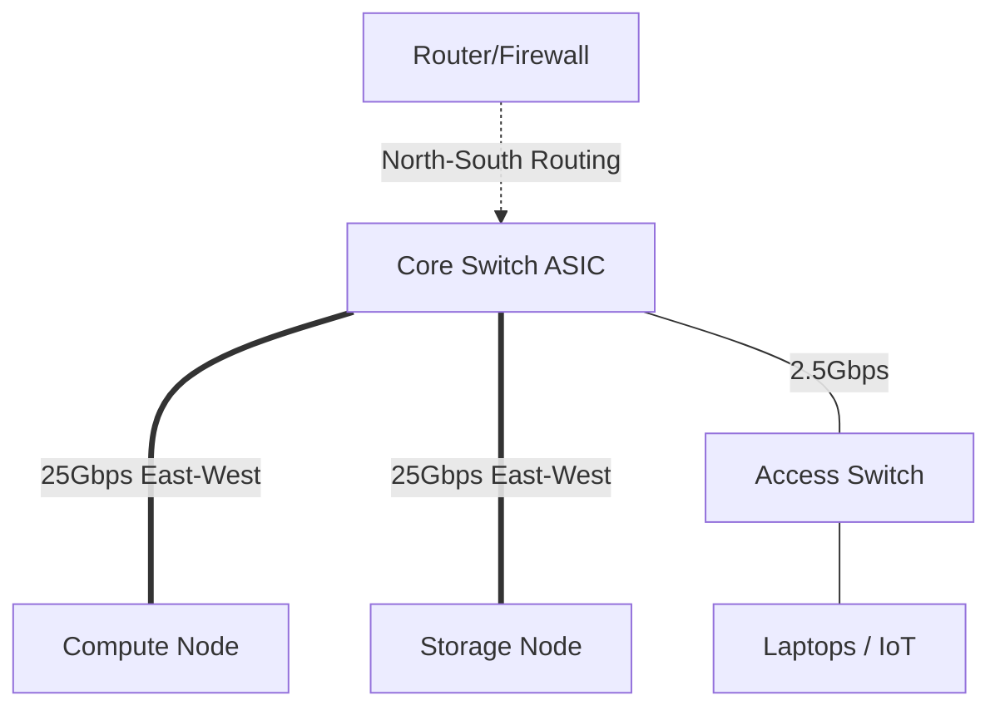

# Network Topologies

When designing an enterprise homelab, the physical layout of switches and routers dramatically impacts performance—especially when routing between VLANs.

## The Physics of Network Traffic

Before looking at topologies, it is crucial to understand *how* data flows in a modern homelab:

*   **North-South Traffic:** Data moving in and out of the network (e.g., your laptop accessing the internet, or an external user accessing your Plex server).
*   **East-West Traffic:** Data moving laterally between servers within the network (e.g., your Proxmox compute node pulling a container image from your TrueNAS storage node).

> [!TIP]
> In an enterprise homelab, East-West traffic absolutely dwarfs North-South traffic. A 1Gbps internet connection handles North-South, but your storage-to-compute backplane often requires 10Gbps, 25Gbps, or even 100Gbps of East-West bandwidth to prevent bottlenecks during AI inference or massive ZFS replication.

## Traditional: Router-on-a-Stick (Legacy)

In a flat network or a simple VLAN setup, the default design is often a "Router-on-a-Stick".

Here, all cross-VLAN routing happens on the firewall/router CPU. A single cable (a Trunk Port) connects the central switch to the router. 

**Why it fails at scale:** If your 25G storage pool talks to your 10G compute pool across different VLANs, the traffic must travel from the Storage Node, up the trunk link to the Router, get processed by the Router's CPU, and travel back down the exact same trunk link to the Compute node. This is called *hairpin routing*. The router CPU will immediately choke, creating a massive bottleneck and destroying your 25Gbps investment.

## Collapsed Core (The Enterprise Standard)

To solve the East-West bottleneck, we use a **Collapsed Core** architecture. This design collapses the traditional "Core" and "Distribution" network layers into a single high-speed backbone switch.

In this design, the Core Switch (e.g., a MikroTik CRS510) acts as the high-speed backbone. 

**The Performance Gain:**
While the router still handles inter-VLAN routing for strict security boundaries (e.g., blocking IoT devices from reaching the Management VLAN), we ensure that bulk data transfers (Compute ↔ Storage) occur *within the same VLAN* at the Core Switch layer. 

By keeping heavy East-West traffic strictly at Layer 2 on the same VLAN, the massive traffic never touches the router CPU. It is switched entirely in hardware by the Core Switch's ASIC, guaranteeing line-rate 400Gbps+ performance.

### Layer 3 Hardware Offloading (L3HW)

Advanced switches (like the MikroTik CRS3xx/CRS5xx series) blur the line further by offering **L3 Hardware Offloading**. 

Instead of sending cross-VLAN traffic to the router CPU, the switch's ASIC can route packets between VLANs at wire speed. This allows you to place Compute and Storage on separate VLANs for security, without suffering the CPU bottleneck of a Router-on-a-Stick topology.
