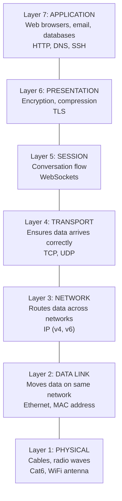

# OSI Model

Network communication happens in seven layers. Each layer has a specific job and only needs to care about the layers directly above and below it.

## Traffic Types (How Data Moves)

Our design heavily targets Layer 2 (L2) and Layer 3 (L3).

*   **Layer 2 (Data Link - "The Same Room"):** This is traffic between devices on the *same* network segment using physical MAC addresses. It is handled by **switches**. Think of it as talking to someone in the same room. It is extremely fast because it happens entirely in hardware. 
*   **Layer 3 (Network - "Different Cities"):** This is traffic between *different* network segments using IP addresses. It is handled by **routers**. Think of it as mailing a letter to another city; it must go through a post office (the router) to find its way. This often requires CPU cycles.

**Example:** When your Proxmox EPYC Node (10.0.10.20) talks to your Proxmox Ryzen Node (10.0.10.21) on the same VLAN, that is **L2 traffic**. It never touches the router CPU. When your EPYC Node (10.0.10.20) talks to a container in the Client VLAN (10.0.40.50), that is **L3 traffic**. It must go to the router (default gateway) to be routed across VLANs.

## Layers Working Together

Here is what the stack looks like when a browser request leaves your machine and is unpacked on the server.

```mermaid
flowchart LR
  subgraph Sending [Sending Request]
    direction TB
    S7["Layer 7: Browser sends GET /api/chat"] --> S6["Layer 6: Data compressed"]
    S6 --> S5["Layer 5: Session established"]
    S5 --> S4["Layer 4: TCP stream created"]
    S4 --> S3["Layer 3: IP header (from=.. to=..)"]
    S3 --> S2["Layer 2: Ethernet frame built"]
    S2 --> S1["Layer 1: Electrical signals sent"]
  end

  subgraph Receiving [Receiving Response]
    direction TB
    R1["Layer 1: Signals converted to bits"] --> R2["Layer 2: Frame unpacked"]
    R2 --> R3["Layer 3: IP packet routed to Proxmox"]
    R3 --> R4["Layer 4: TCP stream assembled"]
    R4 --> R7["Layer 7: nginx processes the request"]
  end

  S1 ====|Physical Cable| R1
```

The important practical point is that failures usually map to a layer. A DNS issue is not the same class of problem as a dropped TCP connection or a broken cable.