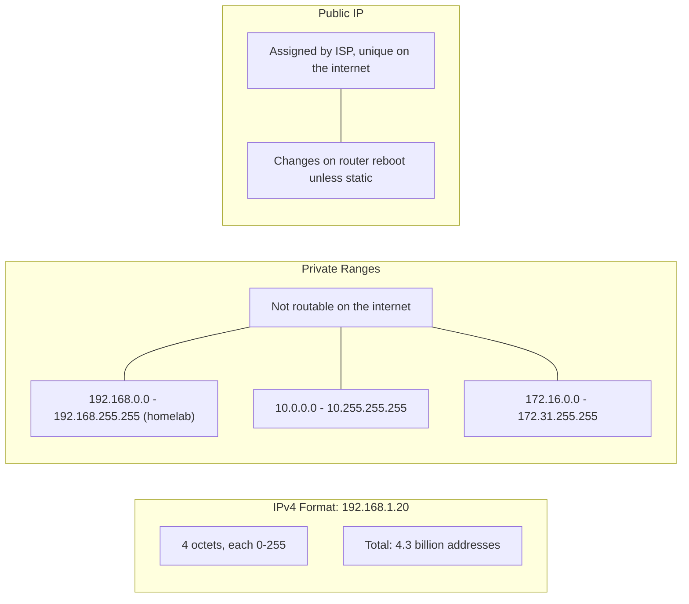
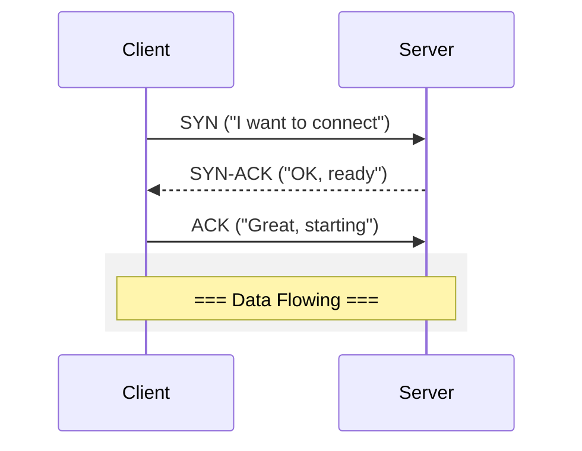

# TCP/IP Protocols

At the transport layer, most homelab traffic reduces to a simple tradeoff: reliability or speed. TCP and UDP make different choices, and your applications inherit those choices.

## IP Addresses

## TCP

TCP guarantees that data arrives in order and that lost packets are retransmitted. It establishes a connection first, then starts sending data.

Used by HTTP, HTTPS, SSH, and databases - anything where missing or reordered data is unacceptable.

## UDP

UDP skips the handshake and sends packets immediately. That makes it faster and simpler, but packets can be lost or arrive out of order.

Used by DNS queries, video streaming, VoIP, and gaming - situations where speed matters more than perfect delivery.

## TCP vs UDP

| | TCP | UDP |
|---|-----|-----|
| Guaranteed delivery | Yes | No |
| Ordered arrival | Yes | No |
| Speed | Slower (handshake overhead) | Faster |
| Use cases | HTTP, SSH, FTP | DNS, video, gaming |

If you are debugging a system, this matters because TCP failures usually look like connection resets, retries, or timeouts, while UDP failures often look like intermittent packet loss or missing responses.