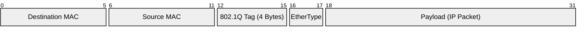

# VLANs & Broadcast Domains

At a physical level, a network switch connects devices together. But as a homelab scales to encompass management interfaces, guest networks, and exposed DMZ containers, placing every device on the same physical switch without logical separation becomes a massive security and performance liability. 

This is where Broadcast Domains and Virtual LANs (VLANs) come in.

## The Cost of Broadcast Domains

A **Broadcast Domain** is the logical boundary where all nodes can hear each other's Layer 2 background noise.

When a device connects to a network, it constantly shouts into the void to discover its surroundings:
- *“Who has the IP `192.168.1.1`? Tell `192.168.1.50`!”* (ARP Requests)
- *“Is there a DHCP server out here? I need an IP!”* (DHCP Discover)

In a flat network, **every single device** connected to the switch must receive, process, and discard these broadcast packets. 

> [!WARNING]
> **Broadcast Radiation:** In an enterprise homelab running dozens of VMs and LXCs, this background noise adds up. Your Proxmox host's CPU has to interrupt its workload to process every single broadcast packet on the network, even if it's just a smart TV asking for an IP address.

By shrinking the size of a broadcast domain, we restrict the noise.

## VLANs (Virtual LANs)

A VLAN splits a single physical switch into multiple isolated virtual switches. 

Think of it as dividing a large office building into secure floors. Devices on VLAN 10 (Floor 1) physically share the same switch chassis as devices on VLAN 20 (Floor 2), but they cannot hear each other's broadcasts. More importantly, they cannot communicate with each other at all unless the traffic passes through a Layer 3 router (the security desk) mediating the connection.

### The 802.1Q Standard (How it works)

VLANs are not magic; they are explicitly defined in the Ethernet frames traversing your cables using the **IEEE 802.1Q** standard.

When a switch processes traffic for a VLAN, it inserts a 4-byte header into the standard Ethernet frame. This header contains the **VLAN ID** (a number from 1 to 4094).

## Trunk Ports vs. Access Ports

Because frames now contain this 4-byte tag, devices on the network need to know how to read it.

*   **Access Port:** The port is assigned to a single VLAN (e.g., VLAN 40). The device connected to it (like a PC, TV, or unmanaged switch) has no idea VLANs exist. It sends standard, untagged traffic. As the traffic enters the switch, the switch **adds** the VLAN 40 tag. As traffic leaves the port toward the PC, the switch **strips** the tag.
*   **Trunk Port:** The port carries multiple VLANs. The traffic remains "tagged" as it leaves the switch. The device receiving the traffic (like a Proxmox host or another managed switch) must be "VLAN-aware" so it can read the 802.1Q tag and sort the traffic accordingly.

### Native VLANs and PVID

What happens if an untagged packet arrives on a Trunk Port?

This is handled by the **Native VLAN** (or PVID - Port VLAN ID). The switch assigns any untagged traffic arriving on a trunk port to the Native VLAN. 

> [!CAUTION]
> **VLAN Hopping:** Misconfiguring the Native VLAN is a common security vulnerability. As a best practice, the Native VLAN on trunk ports should be set to an unused "black hole" VLAN (e.g., VLAN 999) to drop untagged, unauthorized traffic.

## Proxmox Integration (`vmbr0`)

In a homelab, your Proxmox host connects to the switch via a Trunk Port. 

Inside Proxmox, the default virtual bridge (`vmbr0`) acts as a virtual managed switch. When you check the "VLAN aware" box in Proxmox's network settings, `vmbr0` learns how to read 802.1Q tags. 

When you create a VM and type "10" into the VLAN Tag box, Proxmox creates a virtual Access Port for that specific VM. The VM thinks it is on a normal flat network, but Proxmox tags all its traffic as VLAN 10 before sending it down the physical Trunk Port to your core switch.
