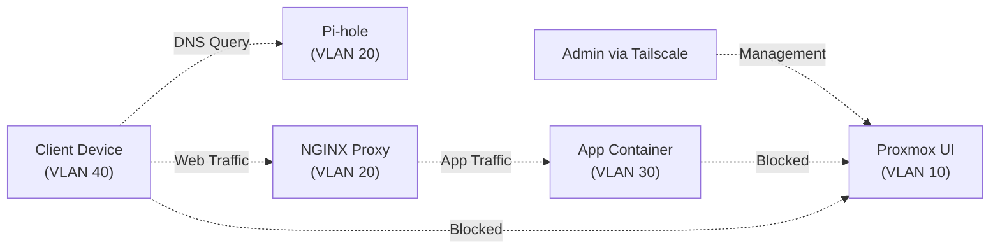

# Network Segmentation Migration

A single, flat network is easy to build but hard to defend.

When every device shares the same broadcast domain, a compromised application container has direct access to the hypervisor management interface, the storage backend, and the network switches. That is why this lab migrated from a flat `192.168.50.0/24` subnet to a segmented architecture.

The goal is not to add complexity for its own sake. The goal is to define strict trust boundaries so that production workloads can run safely without exposing the control plane.

## The Problem With Flat Networks

In the old flat architecture, a single subnet handled everything from management interfaces (Proxmox, TrueNAS) and core services (DNS, DHCP), to compute workloads (Docker, VMs) and client devices (laptops, phones).

If a public-facing service was compromised, the attacker had unrestricted lateral movement. The entire lab was a single trust zone.

## The Segmented Architecture

The new design removes the flat subnet and introduces a segmented `10.0.x.x` structure managed by a MikroTik gateway. It uses explicit VLANs to isolate traffic.

### Trust Boundaries In Practice

The real value of this segmentation is controlling the flow of traffic between zones:

### Logical Segmentation

| VLAN | Subnet | Role | Devices | Security Posture |
| :--- | :--- | :--- | :--- | :--- |
| **10** | `10.0.10.0/24` | **Management** | Proxmox UIs, TrueNAS UI, Switches | **Isolated.** No outbound WAN. Default-deny inbound. Accessible only via Tailscale. |
| **20** | `10.0.20.0/24` | **Core Services** | Pi-holes, NGINX Proxy, Tailscale | **Middleman.** Allows cross-VLAN routing for DNS. Bridges authenticated external VPN traffic. |
| **30** | `10.0.30.0/24` | **Compute** | Docker, VMs, App containers | **Production.** Standard outbound WAN. Application ingress flows through the proxy. |
| **40** | `10.0.40.0/24` | **Clients** | Laptops, Phones, Access Points | **Trusted LAN.** Uses VLAN 20 Pi-holes for DNS. Blocked from VLAN 10 directly. |

### Hardware Topology

The physical backbone relies on MikroTik hardware to handle routing and switching. A MikroTik RB5009 gateway handles the WAN connection, firewall rules, and inter-VLAN routing. A MikroTik CRS510 core switch handles 10G/25G server traffic, while a MikroTik CRS310 access switch distributes 2.5GbE to edge devices and access points.

High-bandwidth internal traffic, such as compute nodes talking to storage, is configured to stay entirely on the switch ASICs. This hardware offloading bypasses the router's CPU to maintain line-rate performance.

## Infrastructure As Code

Manual GUI configurations are brittle. They rely on memory and are hard to reproduce. 

This network state is defined declaratively using Ansible. The bridges, VLANs, and firewall rules are stored as code. 

That ensures idempotency, meaning the playbook only changes things that drift from the defined state. It provides safety by automatically taking a backup on the router before applying changes. It allows for fast recovery, so if a switch dies, the configuration can be restored to a replacement unit in minutes. Finally, passwords and API keys are stored securely using Ansible Vault, never in plain text.

## Mitigating Risk

Segmenting a network introduces the risk of locking yourself out. 

The primary mitigation is keeping one port on the router off the bridge. This untagged emergency port gets a dedicated static IP. If a VLAN change breaks routing, a laptop plugged directly into this port restores access without needing a full factory reset.

The second mitigation is hardware offloading. By ensuring high-bandwidth nodes (like Proxmox and TrueNAS) share a VLAN on the core switch, that heavy traffic never reaches the router, preventing CPU exhaustion on the gateway.

## The Baseline Is Set

With the network segmented and managed by code, the foundation is stable. The next phase moves up the stack to the compute layer: configuring the Proxmox nodes and validating the storage backend.
