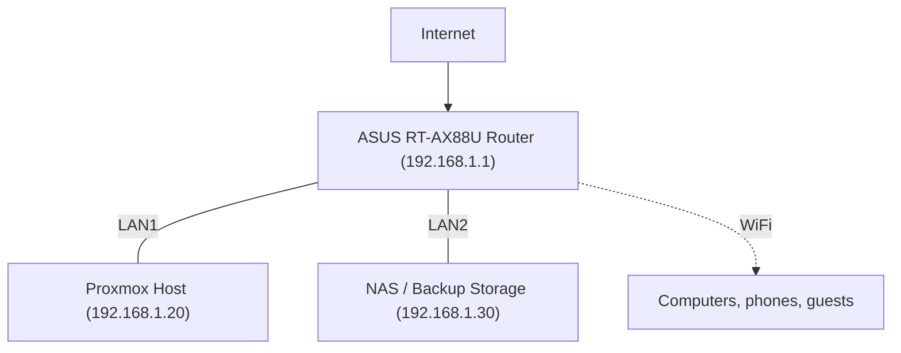
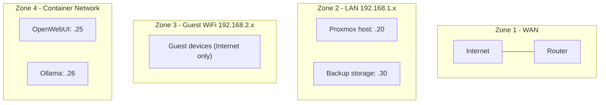
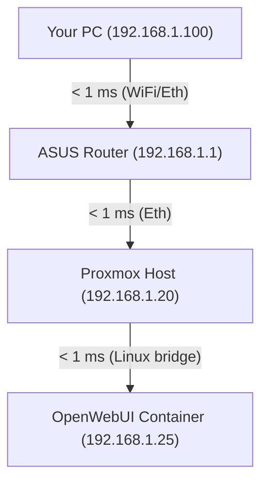
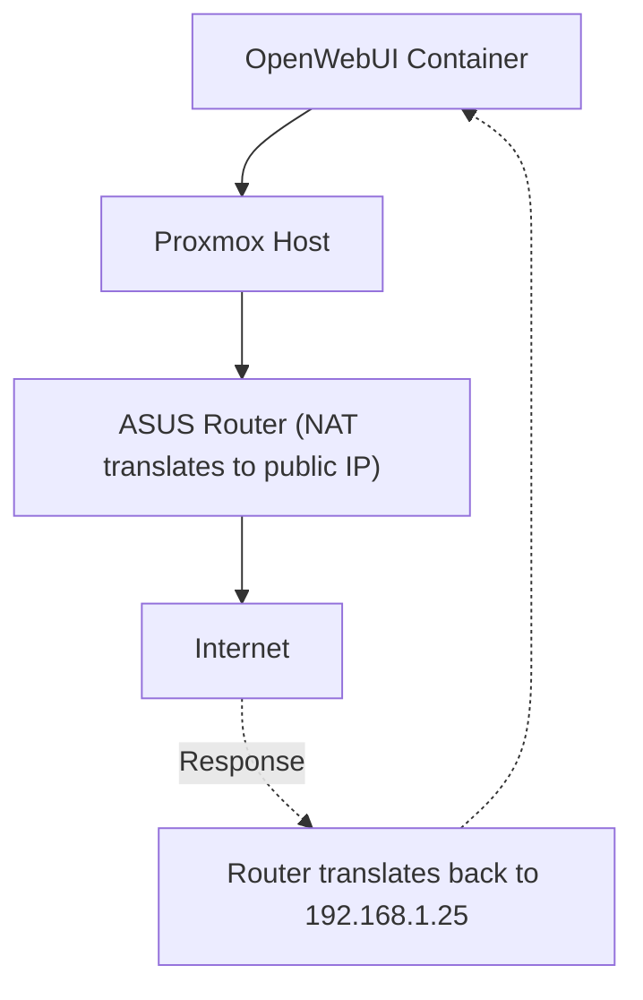
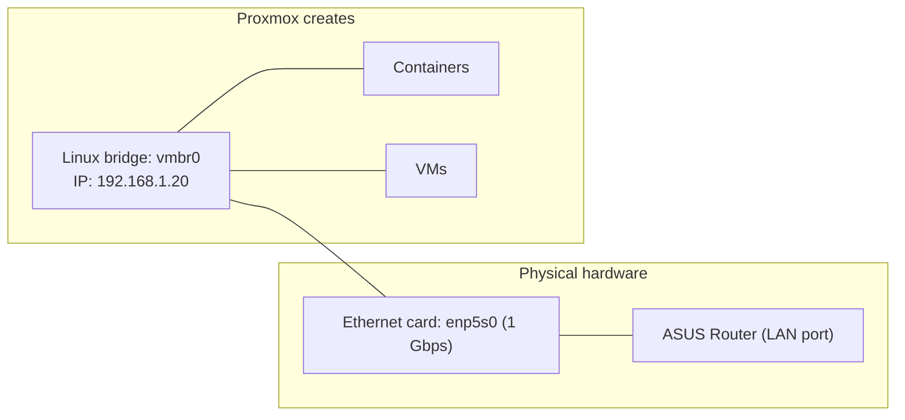
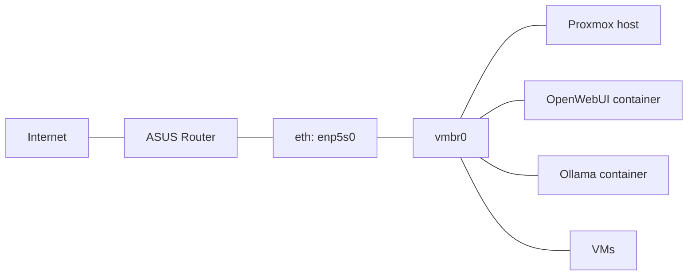
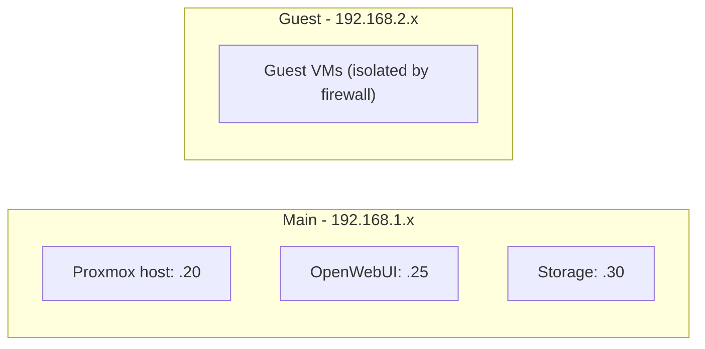
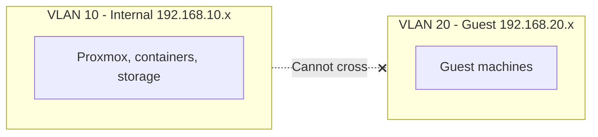

# Linux Bridges in Proxmox

This page covers how a Proxmox host connects the physical LAN to containers and VMs through Linux bridges.

## Physical Layout



That `.30` storage role can be a dedicated NAS box, but it can also be the Proxmox-backed NAS tier described in [TrueNAS SCALE On Proxmox](/pages/proxmox/workloads/truenas-scale). The network model stays the same even when the implementation moves from a host-side export to a dedicated NAS VM.

## Network Zones



## Traffic Flow Examples

### Access OpenWebUI from your PC



### Container Accesses an External Service



The container's private IP is never visible on the internet.

## Physical To Virtual



## Linux Bridges Explained

Think of a bridge as a virtual network switch inside the Proxmox host.



All devices connected to the same bridge can reach each other and the outside world through the physical card.

## Multiple Bridges

You can create extra bridges if you want separate traffic domains.



## Bridges vs VLANs

### Bridge

All devices on the same bridge share one flat Layer 2 network.

```text
vmbr0 - everyone on 192.168.1.x can talk to everyone else
```

### VLANs

VLANs split a physical switching fabric into logical networks.



VLANs require hardware that supports 802.1q tagging. For a single-host homelab, one flat bridge is usually enough at the start.