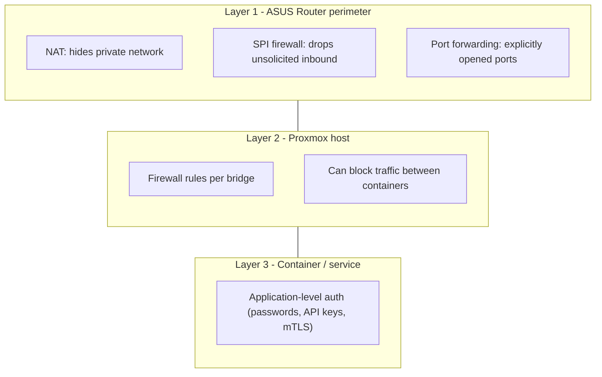

# Network Security

Good homelab security is layered. The router, the hypervisor, and the individual service all contribute different controls.

## Layered Defense



## Firewall Rule Example

```bash
# Allow web traffic to OpenWebUI from LAN only
iptables -I INPUT -s 192.168.1.0/24 -p tcp --dport 8080 -j ACCEPT
iptables -I INPUT -p tcp --dport 8080 -j DROP

# Block Telnet inbound
iptables -I INPUT -i eth0 -p tcp --dport 23 -j DROP
```

## Pi-hole

DNS-level filtering can stop entire classes of traffic before a client ever reaches them.

```mermaid
flowchart TD
  subgraph Without_Pihole [Without Pi-hole]
    direction LR
    D1["Device"] --> DNS1["DNS"]
    DNS1 --> M1["malware.com resolves"]
    M1 --> C1["device connects"]
    C1 --> I1["infected"]
  end
  
  subgraph With_Pihole [With Pi-hole]
    direction LR
    D2["Device"] --> DNS2["Pi-hole DNS"]
    DNS2 --> M2["malware.com is blocked"]
    M2 --> DRP["drops query"]
    DRP --> S["safe"]
  end

  subgraph Benefits [Benefits]
    direction TB
    B1["Network-wide protection"]
    B2["No per-device config"]
    B3["Blocks ads and malicious domains"]
    B4["Free, open-source"]
  end
```



That kind of filtering does not replace firewalling or authentication, but it is a useful low-cost control for home infrastructure.