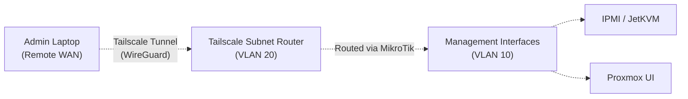

# Tailscale ZTNA & Subnet Routing

A non-negotiable requirement for this homelab architecture is 24/7, highly secure remote access to all infrastructure management interfaces (SSH, IPMI, JetKVM, Proxmox GUIs, and Observability dashboards). 

In the past, homelabs achieved this via explicit port forwards on the router or by exposing internal services via Cloudflare Tunnels. While reverse proxy tunnels obscure your public IP and avoid opening firewall ports, they still fundamentally expose an endpoint to the public internet.

This architecture explicitly deviates from those designs. Instead, we use a **Zero Trust Network Access (ZTNA) overlay**.

## The ZTNA Philosophy

The ZTNA model operates on a simple premise: **Authenticate before you route.**

1. **No Inbound WAN Ports:** The MikroTik gateway maintains a strict default-deny policy for all inbound internet traffic. 
2. **Mandatory MFA:** All remote access via the Tailscale overlay requires Multi-Factor Authentication (MFA) utilizing a TOTP application tied to the primary Identity Provider (IdP).
3. **Mathematical Proof:** Unlike traditional port-forwarding where an attacker can hit the application's login screen and attempt brute-force attacks, the ZTNA model ensures that a user must mathematically prove their identity *before* any network packets are allowed to reach the internal services.

## Architecture: The Subnet Router

We use **Tailscale** to broker this secure mesh network. However, installing the Tailscale client on every single bare-metal server, hypervisor, and IPMI interface is impractical and pollutes the management layer. 

Instead, we use a **Subnet Router** model:
- A dedicated Tailscale node (an LXC container or lightweight VM) resides in **VLAN 20 (Core Services)**.
- When an administrator connects from their laptop via the Tailscale client, they securely tunnel into VLAN 20.
- The MikroTik gateway then handles routing that authenticated traffic from VLAN 20 into **VLAN 10 (Management)**, granting access to IPMI, JetKVM, and the Proxmox GUIs.



## Network Automation (Ansible)

To align with our [Infrastructure as Code (IaC) principles](/pages/networking/homelab-architecture/iac-ansible-network-primer), we do not configure these rules manually via the MikroTik CLI. Doing so would create configuration drift that gets wiped out the next time the network playbooks run.

Instead, we define these ZTNA routing rules declaratively in our Ansible roles (specifically within `roles/mikrotik_base/tasks/main.yml`).

Because our baseline is a strict deny-all for inter-VLAN routing, we must explicitly permit this flow using the `community.routeros` collection.

### 1. Allow Established and Related Traffic

First, ensure that return traffic is permitted. If the Management interface replies to your browser request, the router must allow that response back through to the Subnet Router.

```yaml
- name: Firewall - Allow established and related traffic
  community.routeros.api:
    path: /ip/firewall/filter
    add:
      chain: forward
      action: accept
      connection-state: established,related
      comment: "Allow established and related traffic"
```

### 2. Permit ZTNA to Management Routing

Next, add an explicit rule allowing new connections from the specific IP of the Tailscale Subnet Router to cross into the Management VLAN. 

*Assume `10.0.20.50` is the IP of your Tailscale node, and `vlan10` is the management interface.*

```yaml
- name: Firewall - Allow Tailscale ZTNA to Management
  community.routeros.api:
    path: /ip/firewall/filter
    add:
      chain: forward
      action: accept
      in-interface: vlan20
      out-interface: vlan10
      src-address: 10.0.20.50
      connection-state: new
      comment: "Allow Tailscale ZTNA to Management"
```

By strictly defining the `src-address` and keeping this in version control, you ensure that only the Tailscale node can initiate traffic into the management layer, and the configuration is entirely reproducible.

## Future ZTNA Migration Effort

While Tailscale is the chosen standard for its ease of use and NAT traversal capabilities, the architecture is designed so the overlay can be swapped if requirements change.

*   **To Headscale (Self-Hosted Tailscale Control Server):** *Low to Medium Effort.* Because Headscale uses the official open-source Tailscale clients, the client software does not change. Migration involves spinning up the Headscale server, configuring your own OIDC/SSO integrations for MFA, and updating all clients via the command line to point to the new login server URL.
*   **To Twingate (Proxy-based ZTNA):** *High Effort.* This involves a fundamental architectural shift. The Tailscale Subnet Router would be replaced by Twingate Connectors. Instead of a full L3 overlay network, every internal resource (IP and Port) must be manually defined in the Twingate console, and all end-user devices would require the installation of new Twingate client software.
