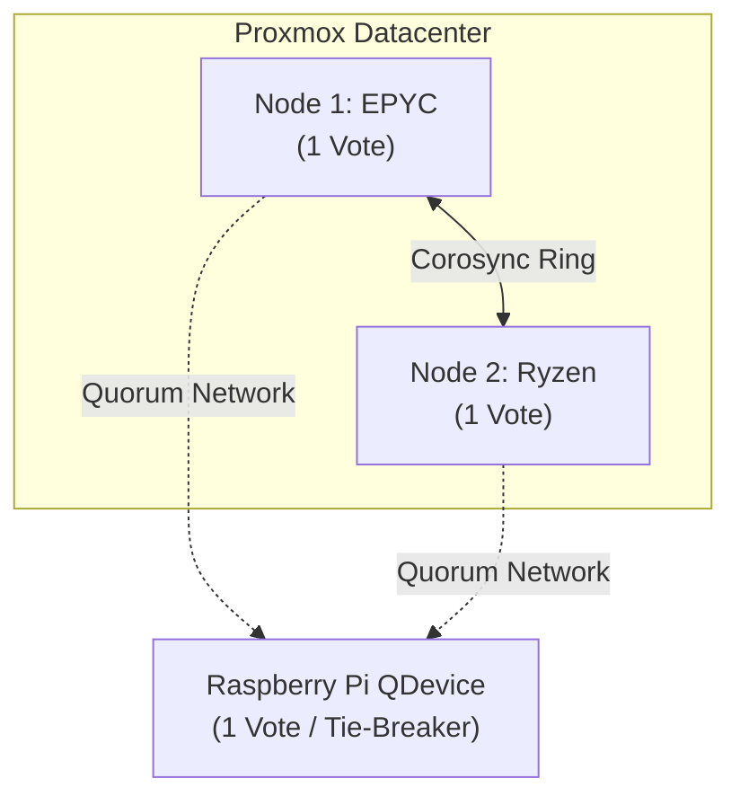

# Cluster Architecture: Standalone vs Clustered

When you expand from a single server to a disaggregated architecture (like our Node 1 EPYC Backend and Node 2 Ryzen Frontend), you face a fundamental architectural choice: do you join them into a unified **Proxmox Cluster**, or run them as **Independent Standalone Nodes**?

Both are valid, but they optimize for entirely different failure domains.

## Option A: Independent Standalone Nodes (Maximum Resilience)

In a standalone setup, the EPYC node and the Ryzen node do not know the other exists from a management perspective. You access them via two separate web interfaces (e.g., `10.0.10.20` and `10.0.10.21`).

### The Upside
- **No Quorum Headaches:** Because they aren't voting on state, you can reboot, patch, or completely destroy one node without affecting the other's ability to run VMs.
- **Simplicity:** No Corosync network rings to configure.
- **Failure Domain Isolation:** A network loop or switch failure won't cause the hypervisors to panic and fence themselves.

### The Tradeoff
- **No Live Migration:** You cannot right-click a VM and select "Migrate". Moving a VM requires backing it up to the Proxmox Backup Server (PBS) and restoring it on the other node.
- **No Single Pane of Glass:** You have to log into multiple tabs to see your whole lab.

## Option B: Proxmox Cluster (Centralized Management)

A Proxmox cluster merges both nodes into a single logical "Datacenter". Logging into either node's IP address shows you the status, VMs, and storage for *both* nodes simultaneously.

### The Upside
- **Single Pane of Glass:** One UI to rule them all.
- **Live Migration:** You can migrate a running container or VM from the Ryzen node to the EPYC node with zero downtime, provided they share the same CPU flags (or use `kvm64` emulated CPUs) and storage endpoints.
- **High Availability (HA):** Proxmox can automatically restart a VM on the surviving node if a hardware failure occurs.

### The Tradeoff: The Two-Node Quorum Problem

Proxmox relies on `Corosync` to manage cluster state. Corosync uses a strict voting system to prevent **Split-Brain**—a catastrophic scenario where two nodes lose network contact with each other, both assume the other is dead, and both try to write to the same shared storage array, instantly corrupting it.

To prevent this, Proxmox enforces **Quorum**. The cluster must have a strict majority of votes (>50%) to operate. 

In a 2-node cluster, each node has 1 vote. The total is 2.
If you reboot the Ryzen node, the EPYC node is left with 1 vote out of 2 (50%). 
Because 50% is not a majority, the EPYC node immediately **loses quorum**. It locks its configuration into "Read-Only" mode. You cannot start, stop, or edit any VMs on the EPYC node until the Ryzen node comes back online.

### The Solution: Corosync QDevice

To safely run a 2-node cluster, industry best practice mandates a **QDevice** (Quorum Device). 

This is a tiny, separate piece of hardware—like a Raspberry Pi or an old laptop—running a lightweight voting daemon. 
- EPYC Node = 1 vote
- Ryzen Node = 1 vote
- Raspberry Pi QDevice = 1 vote
- Total = 3 votes.

Now, if you reboot the Ryzen node, the EPYC node + the Raspberry Pi = 2/3 votes. Quorum is maintained, and the EPYC node remains fully operational.

## The Verdict

If you have a 3rd piece of hardware to act as a QDevice, **Clustering** provides the best operational experience. If you strictly only have two machines and value resilience over convenience, **Standalone** is the safer enterprise choice.
